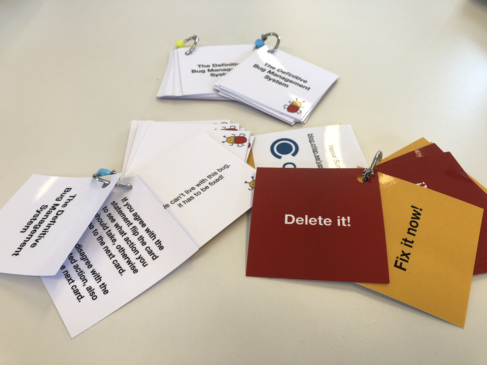

## The Definitive Bug Management System!

Welcome to Fix It Now or Delete It!

Do you have a mountain of bugs? Are you tired of sitting in endless meetings to go through them, only to have to do it all over again at the next meeting? Would you prefer to focus on creating the best product possible instead? Well, using this system you can stop managing bugs and start focusing on quality.

### The system
Are you ready to prioritize and fix the bug? If so, then fix it now.
If not, then delete it.

It's that simple. When it comes to bugs, you only have two options: Fix it now or delete it.

For more details you can:
 * read the original blog entry: <a href="https://blog.crisp.se/2018/02/05/yassalsundman/stop-managing-bugs-start-focusing-on-quality" target="_blank">Stop Managing Bugs, Start Focussing on Quality</a>
 * or watch the lightning talk from the Agila Sverige conference in 2018:  <a href="https://agilasverige.solidtango.com/video/dealing-with-bugs-by-deletion" target="_blank">Dealing with Bugs by Deletion</a>

We hope the resources below will help you succeed in your journey to zero bugs.

### Info graphic

A visual explanation of the system, now available in two languages:

Download the pdf in <a href="https://ydsundman.github.io/FixItNowOrDeleteIt/images/info-graphic-bug-en.pdf" target="_blank" >English</a> or in <a href="https://ydsundman.github.io/FixItNowOrDeleteIt/images/info-graphic-bug-sv.pdf" target="_blank" >Swedish</a>

 

### The book
Download for free on <a href="https://leanpub.com/fixitnowordeleteit" target="_blank">LeanPub</a>

### The app

### The cards!

<a href="https://ydsundman.github.io/FixItNowOrDeleteIt/images/BugSystem.pdf" target="_blank" >Download</a> the cards to print yourself.

Instructions: Print the document as a double sided page. The cards are in order and start from the top left corner. Go through the cards row by row until you end at the last card on the bottom right corner. Laminate the cards (or use thicker paper) then cut along the dotted lines, finally hole punch the corner and attach them with a ring.

[Contact us](mailto:fixitnowordeleteit@yds.se) if you need a larger order of the cards. Or if you're in Stockholm, pass by the Crisp office to pick some up!

### The t-shirt
You can buy the t-shirt at the [Crisp gear store](https://shop.spreadshirt.se/crispgear)

### Feedback?
We love feedback. Have a suggestion? Want to log a bug ;) ?

Please [contact us](mailto:fixitnowordeleteit@yds.se)

### About us
We're [Daniel](https://www.linkedin.com/in/danielsundman/) and [Yassal](https://www.linkedin.com/in/yassal-sundman/). We're both coders and one of us is also a team and organization coach! You can find us at [YDS](https://yds.se). Need help coding ReactNative apps or coaching your org? We'd be happy to set up a meeting to talk!

[Privacy Policy](privacy_policy.md)
