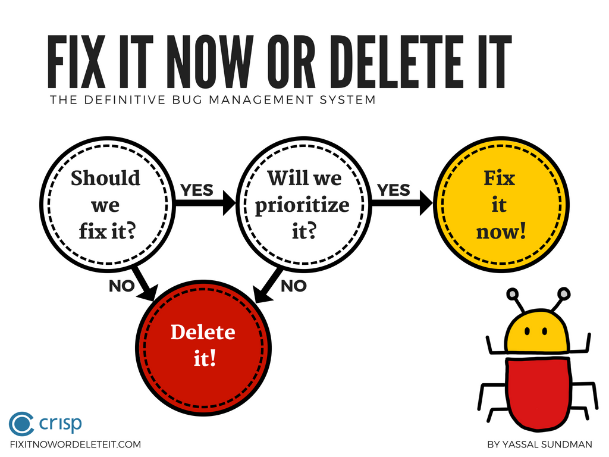

## The Definitive Bug Management System!

Welcome to Fix It Now or Delete It!

Do you have a mountain of bugs? Are you tired of sitting in endless meetings to go through them, only to have to do it all over again at the next meeting? Would you prefer to focus on creating the best product possible instead? Well, using this system you can stop managing bugs and start focusing on quality.

### The system
Are you ready to prioritize and fix the bug? If so, then fix it now.
If not, then delete it.

It's that simple. When it comes to bugs, you only have two options: Fix it now or delete it.

For more details you can read the original blog entry: <a href="https://blog.crisp.se/2018/02/05/yassalsundman/stop-managing-bugs-start-focusing-on-quality" target="_blank">Stop Managing Bugs, Start Focussing on Quality</a>

We hope the resources below will help you enjoy your journey to zero bugs.

### Info graphic

A visual explanation of the system, now available in two languages:

<a href="https://ydsundman.github.io/FixItNowOrDeleteIt/images/info-graphic-bug-en.pdf" target="_blank" >Download</a> the pdf in English

<a href="https://ydsundman.github.io/FixItNowOrDeleteIt/images/info-graphic-bug-sv.pdf" target="_blank" >Download</a> the pdf in Swedish

### The cards!

[Contact us](mailto:fixitnowordeleteit@yds.se) to get copies of our easy to use cards:

### The app

### The t-shirt
You can order the t-shirt at the [Crisp gear store](https://shop.spreadshirt.se/crispgear)

### Feedback?
We love feedback. Have a suggestion? Want to log a bug ;) ?

Please [contact us](mailto:fixitnowordeleteit@yds.se)

### About us
We're [Daniel](https://www.crisp.se/konsulter/daniel-sundman) and [Yassal](https://www.crisp.se/konsulter/yassal-sundman). We're both coders and one of us coaches teams! We're based in Stockholm and are members of [Crisp](https://www.crisp.se). Need help coding React Native apps or coaching teams? We'd be happy to set up a meeting to talk!
