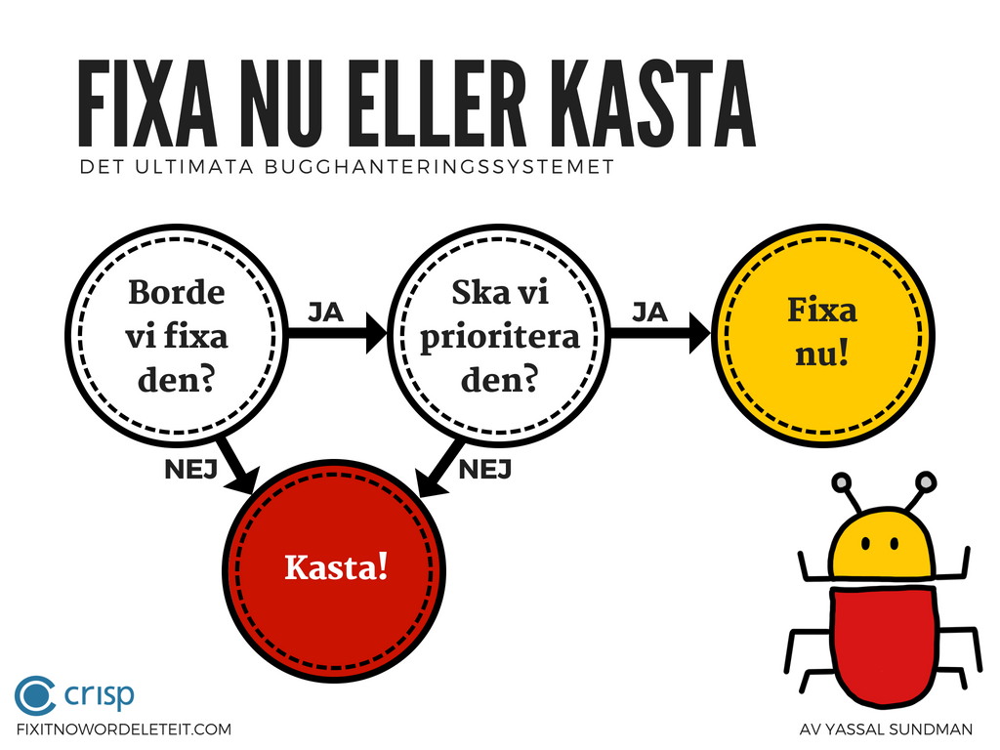

## Fix it now or delete it!

Welcome to The Definitive Bug Management System!

Do you have a mountain of bugs? Are you tired of sitting in endless meetings to go through them, only to have to do it all over again at the next meeting? Would you prefer to focus on creating the best product possible instead? Well, using this system you can stop managing bugs and start focusing on quality.

### The system
Are you ready to prioritize and fix the bug? If so, then fix it now.
If not, then delete it.

It's that simple. When it comes to bugs, you only have two options: Fix it now or delete it.

We hope the resources below will help you enjoy your journey to zero bugs.

### Info graphic

A visual explanation of the system, now available in two languages:

English:

Swedish:

### The cards!

[Contact us](mailto:fixitnowordeleteit@yds.se) to get copies of our easy to use cards:

### The app
MVP version available for:

[Android](https://play.google.com/store/apps/details?id=se.yds.dbms)

[iOS](https://itunes.apple.com/us/app/fix-it-now-or-delete-it/id1390222365?ls=1&mt=8)

### Feedback?
We love feedback. Have a suggestion? Want to log a bug ;) ?

Please [contact us](mailto:fixitnowordeleteit@yds.se)
